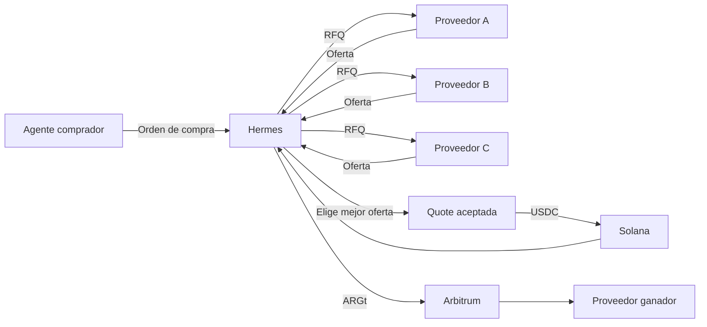

<div align="center">

# 🪽 Hermes

### El protocolo agent-to-agent para negociar y liquidar comercio B2B

Agentes comerciales autónomos que cotizan, negocian y pagan entre sí.

[](https://nextjs.org/)
[](https://www.typescriptlang.org/)
[](https://solana.com/)
[](https://arbitrum.io/)
[](https://www.docker.com/)

</div>

> **Hermes transforma una intención comercial en una operación ejecutable, verificable y liquidada entre agentes.**

## El problema

Las compras B2B siguen dependiendo de emails, planillas, conciliaciones manuales y pagos lentos. Hermes crea un lenguaje operativo común para que agentes compradores y proveedores puedan negociar y liquidar una operación con evidencia de cada paso.

## Cómo funciona



## Qué ofrece Hermes

| Capacidad | Resultado |
| --- | --- |
| Negociación agent-to-agent | Varios proveedores responden y compiten por una orden |
| Motor de decisión | Selección automática de precio, cobertura y condiciones |
| Quotes | Precio, fees, vencimiento y monto final congelados |
| Liquidación cross-chain | USDC en Solana → ARGt en Arbitrum |
| Trazabilidad | Estados, firmas, hashes y gas fees auditables |
| Pagos autónomos | Ejecución sin intervención humana después de la autorización |

## Demo validada

```text
3 USDC recibidos en Solana
        ↓
Precio USDC/ARGt consultado a Twin
        ↓
4744,258517 ARGt liquidados en Arbitrum
        ↓
Proveedor acreditado automáticamente
```

## Estados de una operación

```text
QUOTE_CREATED
      ↓
QUOTE_ACCEPTED
      ↓
SOURCE_PAYMENT_CONFIRMED
      ↓
DESTINATION_PAYMENT_SUBMITTED
      ↓
DESTINATION_PAYMENT_CONFIRMED
      ↓
SETTLED
```

## Stack

**Aplicación:** Next.js 16 · TypeScript

**Datos:** Prisma · PostgreSQL/Supabase

**Redes:** Solana · tokens SPL · Arbitrum One

**Liquidación:** USDC · ARGt de Twin
**Infraestructura:** Docker

## Inicio rápido

```bash
cp .env.example .env
npm install
npm run prisma:generate
npm run prisma:migrate
npm run dev
```

Con Docker:

```bash
docker compose up -d --build
```

Las claves privadas deben permanecer únicamente en variables de entorno y nunca subirse al repositorio.

## Validación

```bash
npm run prisma:validate
npm run typecheck
npm run lint
npm test
npm run build
```

<div align="center">

**Hermes — commerce, negotiated by agents.**

</div>
